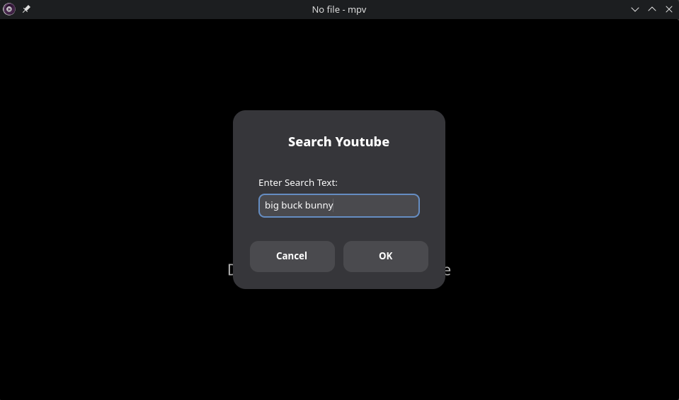
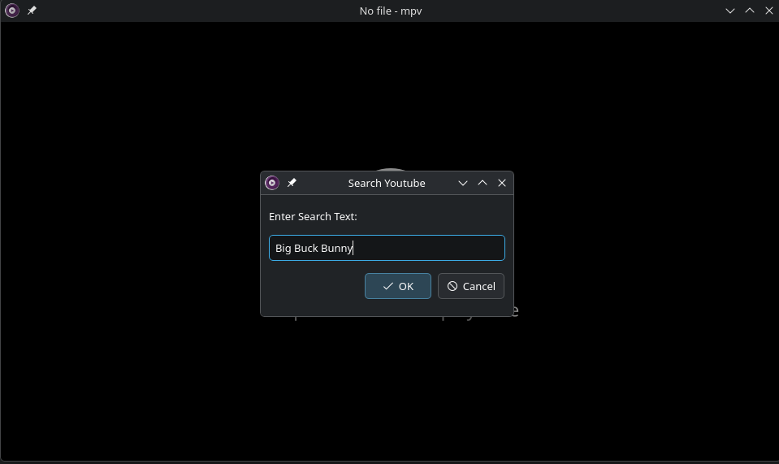
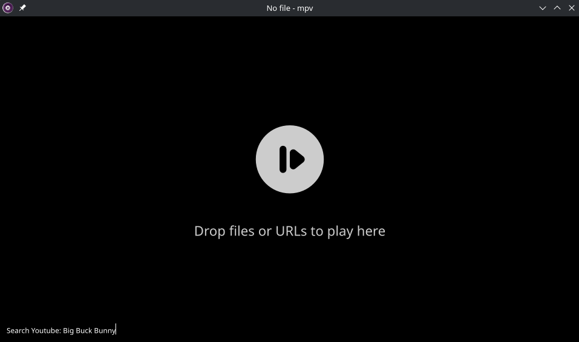

<h1 align="center">🎬 mpv YouTube Search</h1>

<p align="center">
  <em>Search and play YouTube videos directly from mpv media player</em>
</p>

<p align="center">
  <a href="https://mpv.io/"></a>
  <a href="https://github.com/yt-dlp/yt-dlp"></a>
  <a href="LICENSE"></a>
</p>

---

## About

This Lua script for [mpv media player](https://mpv.io/) enables you to search and play YouTube videos without leaving your player. It uses zenity/kdialog/mpinput for the user interface and youtube-dl/yt-dlp for video search and playback.

**Based on** [mpv-zenity-open-files](https://github.com/alifarazz/mpv-zenity-open-files) by alifarazz.

## Features

- Search YouTube directly from mpv
- Multiple UI options: Zenity, Kdialog, or mpinput
- Fast and lightweight
- Simple keyboard shortcuts
- Works on Linux, macOS, and Windows (mpinput version)

## Requirements

- [mpv media player](https://mpv.io/)
- [yt-dlp](https://github.com/yt-dlp/yt-dlp) or youtube-dl
- **For GUI versions:** Zenity or Kdialog

## Installation

### Quick Install

```bash
wget -O ~/.config/mpv/scripts/youtube-search.lua https://github.com/rozari0/mpv-youtube-search/raw/master/youtube-search.lua
```

### Alternative Versions

**For Kdialog:**
```bash
wget -O ~/.config/mpv/scripts/youtube-search.lua https://github.com/rozari0/mpv-youtube-search/raw/master/youtube-search-kdialog.lua
```

**For mpinput:**
```bash
wget -O ~/.config/mpv/scripts/youtube-search.lua https://github.com/rozari0/mpv-youtube-search/raw/master/youtube-search-mpinput.lua
```

## Keybindings

| Key Combination | Action |
|----------------|--------|
| <kbd>CTRL</kbd>+<kbd>SHIFT</kbd>+<kbd>S</kbd> | Search YouTube videos |

## Customization

<details>
  <summary>Click to expand customization options</summary>

  ### Custom Keybindings
  
  Edit the bottom of the **youtube-search.lua** file to change the default keybinding.
  
  ```lua
  mp.add_key_binding("Ctrl+Shift+s", "youtube-search", youtube_search)
  ```

  ### Custom Result Number
  
  Modify the **limit** variable in **youtube-search.lua** to change the number of search results displayed.
  
  ```lua
  local limit = 10  -- Change this value
  ```

</details>

## Screenshots

<details>
  <summary>Zenity Interface</summary>

  
</details>

<details>
  <summary>Kdialog Interface</summary>

  
</details>

<details>
  <summary>mpinput Interface</summary>

  
</details>

## Important Notes

- **Windows Users:** Only the mpinput version is designed to work on Windows
- **Recommended:** Using with [mpv-gallery-view](https://github.com/occivink/mpv-gallery-view/) for an enhanced browsing experience

## Contributing

Contributions, issues, and feature requests are welcome! Feel free to check the [issues page](https://github.com/rozari0/mpv-youtube-search/issues).

## License

This project is licensed under the MIT License - see the LICENSE file for details.

## Acknowledgments

- Based on [mpv-zenity-open-files](https://github.com/alifarazz/mpv-zenity-open-files) by [alifarazz](https://github.com/alifarazz)
- Powered by [yt-dlp](https://github.com/yt-dlp/yt-dlp)

---

<p align="center">Made with love for the mpv community</p>
